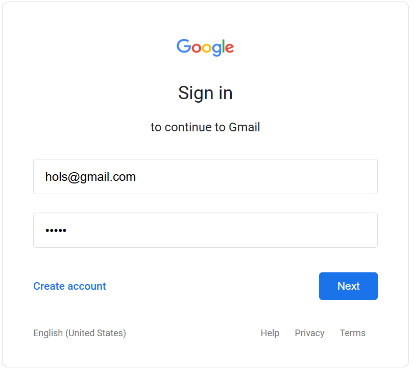

# Educational Fake WiFi Portal

A cybersecurity education tool that demonstrates how attackers create phishing pages through fake WiFi portals.



## ⚠️ DISCLAIMER ⚠️

**This tool is created SOLELY for educational and demonstration purposes.**

* Only use this in controlled classroom environments
* Always inform participants that this is a demonstration
* Never use this tool to collect real credentials
* Unauthorized use may violate laws in your jurisdiction

## Overview

This project simulates a common attack vector: fake WiFi captive portals. When victims connect to a rogue WiFi network, they are redirected to a phishing page mimicking a legitimate service (Google, in this implementation). The tool demonstrates how attackers can easily harvest credentials through seemingly legitimate WiFi networks.

## Features

* Realistic Google sign-in page replica
* Credential capturing and display system
* Educational warnings throughout the interface
* Instructor view to demonstrate captured data
* Works with a standard Windows/Mac/Linux laptop hotspot

## Requirements

* Python 3.6+
* Flask
* Simple DNS Redirector (for DNS redirection)
* A device capable of creating a WiFi hotspot
* Administrator/root privileges (to run on port 80)

## Installation

1. Clone this repository or download the Python script
2. Install required dependencies:
   ```
   pip install flask
   ```
3. Download and install [Simple DNS Redirector](http://www.simpledns.com/dns-redirector)

## Usage

### Setup

1. **Create a WiFi hotspot**:
   - Windows: Settings → Network & Internet → Mobile hotspot
   - macOS: System Preferences → Sharing → Internet Sharing
   - Linux: Use NetworkManager or create a hotspot via command line
   - Set an attractive name like "Free_Airport_WiFi" or "Public_WiFi"

2. **Configure DNS redirection**:
   - Open Simple DNS Redirector
   - Select your hotspot interface
   - Set "Response IP" to your hotspot IP (typically 192.168.137.1 on Windows)
   - Check "Redirect all requests to response IP"
   - Click "Start" to begin the redirection service

3. **Run the Flask application**:
   ```
   # Run as administrator/root to use port 80
   python fake_wifi_portal.py
   ```

### Classroom Demonstration

1. Have students connect to your WiFi hotspot
2. Ask them to open a browser and try to visit any website
3. They will be redirected to the fake Google login page
4. When credentials are entered, they'll be captured
5. Show the captured data at http://YOUR-IP/instructor

## Security Teaching Points

Use this demonstration to teach students:

* **URL verification**: Always check the URL (it won't be accounts.google.com)
* **SSL indicators**: Look for HTTPS and valid certificates
* **Context awareness**: Be suspicious when suddenly asked to log in
* **Public WiFi dangers**: Avoid sensitive transactions on public networks
* **Password hygiene**: Never reuse passwords for important accounts

## Customization

You can modify the templates in the `create_templates()` function to:
* Use different service login pages (Facebook, Microsoft, etc.)
* Add more obvious or subtle indicators of phishing
* Change the captured data stored for demonstration

## Troubleshooting

* **Port 80 already in use**: Try another port (8080) or stop services using port 80
* **Firewall blocking connections**: Allow Python and DNS Redirector through your firewall
* **DNS redirection not working**: Try clearing DNS cache on connecting devices
* **Hotspot not showing up**: Ensure your device supports hotspot functionality

## Legal Considerations

Using this tool to collect actual credentials without authorization is illegal in most jurisdictions and violates:
* Computer Fraud and Abuse Act (US)
* Various data protection regulations (GDPR in EU)
* Unauthorized access laws worldwide

Only use for legitimate educational purposes in controlled environments.

## License

This project is released under the MIT License with additional restrictions prohibiting malicious use.